<p align="center">
  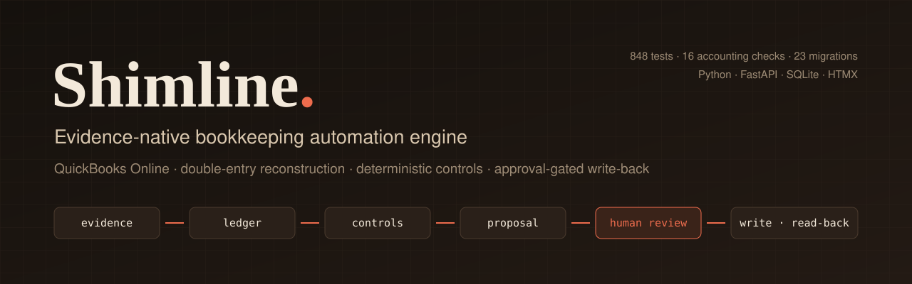
</p>

<p align="center">
  <a href="LICENSE"></a>
  
  
  
  
  <a href="https://github.com/wig1-max/shimline-bookkeeping-engine/actions"></a>
</p>

# Shimline: bookkeeping automation engine for QuickBooks Online

**Shimline** is an open-source **bookkeeping automation engine** for
**QuickBooks Online (QBO)**. It pulls a company's accounting data, rebuilds the
ledger in **double entry**, runs **16 deterministic accounting checks**, and
turns each defect into a **correction proposal**. A human approves every
proposal. The engine then writes it to QuickBooks idempotently, reads the result
back, and re-runs **reconciliation** to prove the fix landed.

It was built for Canadian trades and construction businesses, so it also covers
**GST/HST return preparation**, **job costing**, **project profitability**,
**bank statement matching**, and **client PDF reporting**. It runs as a
multi-tenant FastAPI operations workspace for bookkeeping firms.

> **Status:** archived portfolio project. It was deployed to production on a
> hardened Linux server, then taken offline. Everything here runs locally
> against synthetic companies. It is not a hosted service, tax adviser, or
> substitute for a qualified accountant.

Designed and built by **[Aryan Madaan](https://github.com/wig1-max)**, an
AI-native full-stack developer.

---

## Contents

- [Why it exists](#why-it-exists)
- [Screenshots](#screenshots)
- [Architecture](#architecture)
- [Features](#features)
- [Safety model](#safety-model)
- [Quick start](#quick-start)
- [Run the demo workspace](#run-the-demo-workspace)
- [Testing strategy](#testing-strategy)
- [Tech stack](#tech-stack)
- [Repository map](#repository-map)
- [License](#license)

## Why it exists

Most "AI bookkeeping" tools classify a transaction and hope. Shimline starts
from the questions an accountant asks before trusting a number:

- What source evidence supports this conclusion?
- Which deterministic control allowed it, and which checks didn't run?
- What is missing, ambiguous, or outside policy?
- Who approved the change, and against which exact payload?
- Did QuickBooks accept the change, and does the ledger still reconcile?

Every screen and every table in this repository exists to answer one of those.

## Screenshots

All data below is synthetic. The demo companies come from `synthetic_books.py`
with seeded accounting defects.

**Cleanup review.** The ledger was rebuilt from source documents. The page shows
which checks passed, which didn't run, and why.

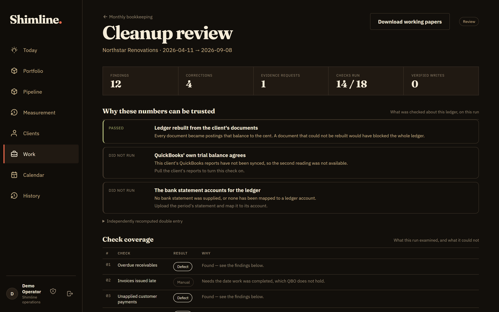

**Proposed corrections.** Each change shows its field-level diff, financial and
tax effect, evidence status, and the QuickBooks `SyncToken` the reviewer saw.
Batch approval is all-or-nothing.

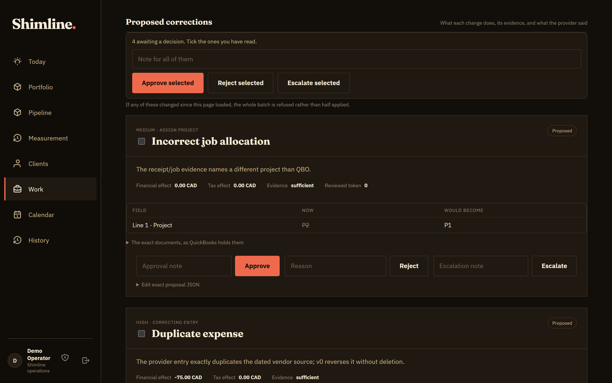

<table>
  <tr>
    <td width="50%">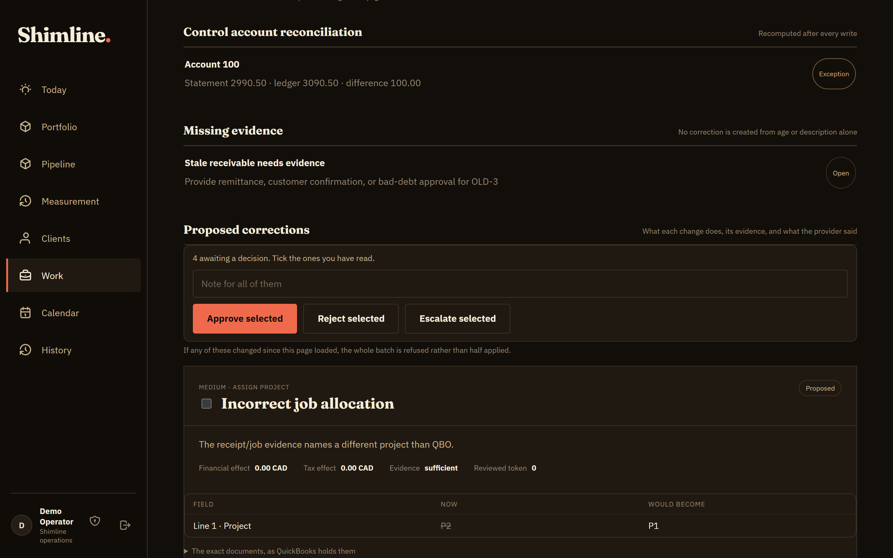<br><sub><b>Reconciliation and evidence requests.</b> No correction is created from age or description alone.</sub></td>
    <td width="50%">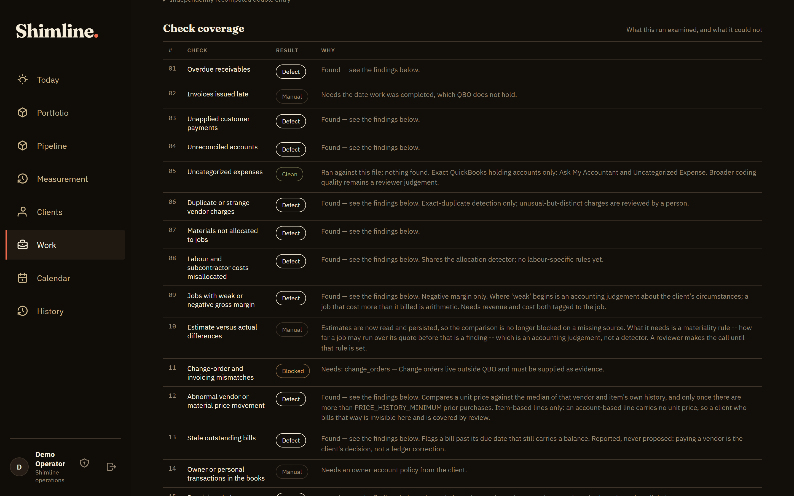<br><sub><b>Check coverage.</b> Every check reports <i>defect</i>, <i>clean</i>, <i>manual</i> or <i>could not run</i>.</sub></td>
  </tr>
  <tr>
    <td width="50%">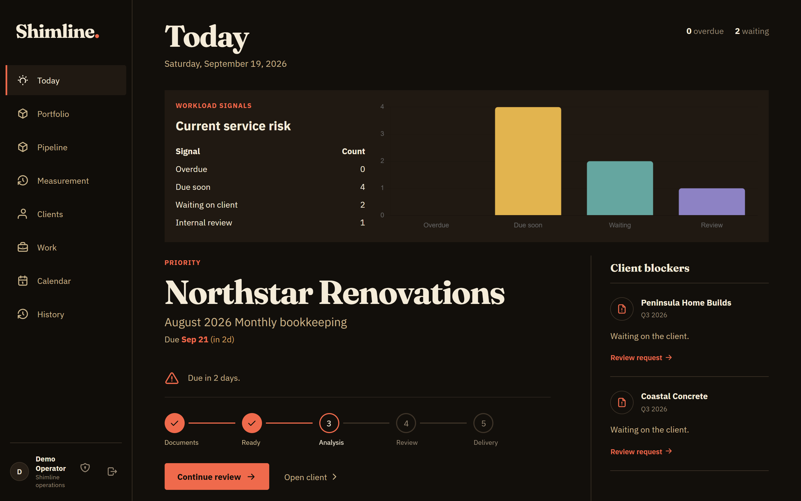<br><sub><b>Today.</b> Workload signals and the single most urgent engagement.</sub></td>
    <td width="50%">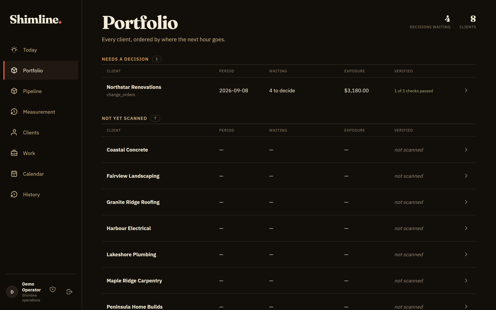<br><sub><b>Portfolio.</b> One queue across every client a firm holds, ranked by exposure.</sub></td>
  </tr>
  <tr>
    <td width="50%">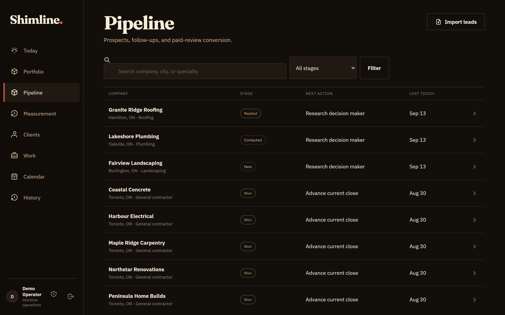<br><sub><b>Pipeline.</b> Built-in CRM from prospect to paid engagement.</sub></td>
    <td width="50%">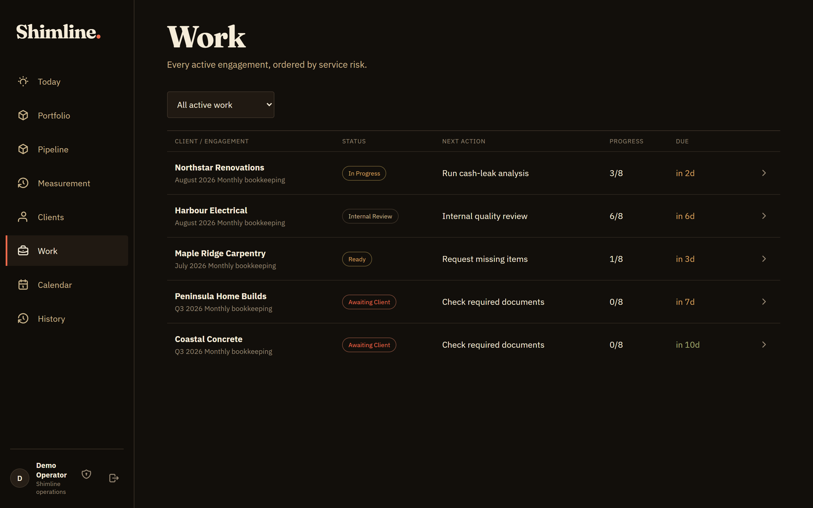<br><sub><b>Work.</b> Engagements moving from documents to delivery.</sub></td>
  </tr>
  <tr>
    <td width="50%">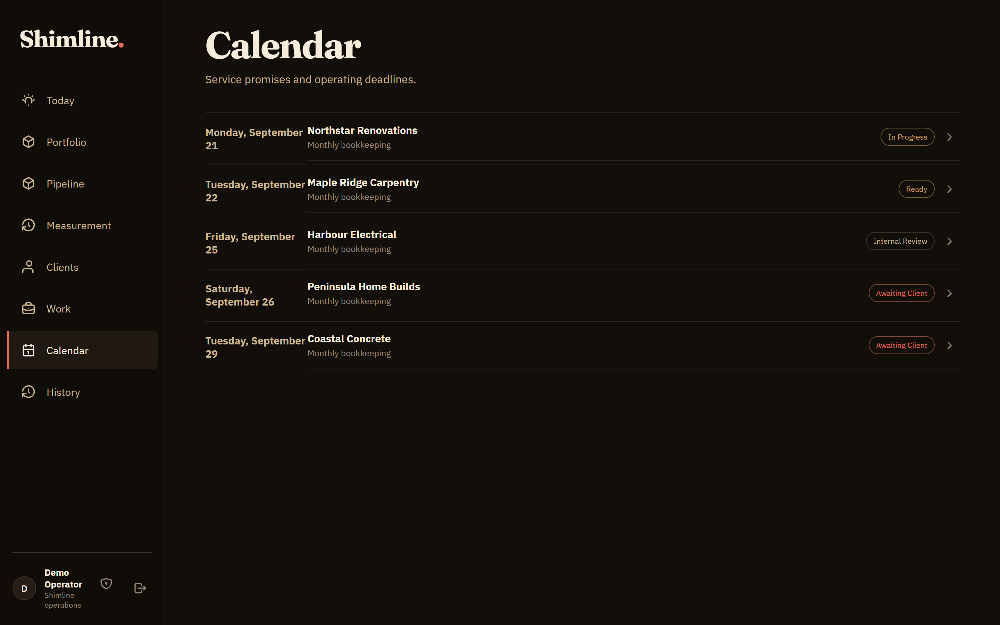<br><sub><b>Calendar.</b> Deadlines on a province-aware business calendar.</sub></td>
    <td width="50%">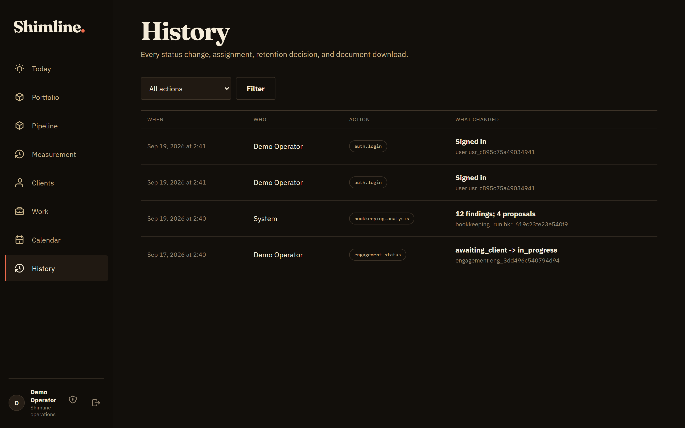<br><sub><b>History.</b> An append-only audit trail of every action.</sub></td>
  </tr>
</table>

## Architecture

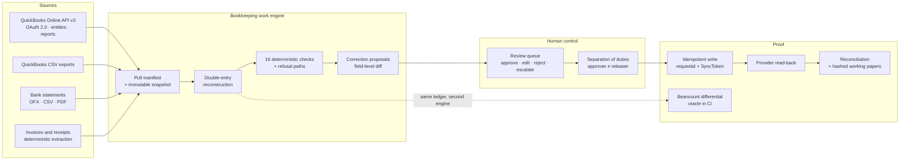

The control loop, as a sentence:

```text
source evidence → normalized ledger → deterministic controls → proposal
    → human approval → idempotent QuickBooks write → read-back → reconciled audit record
```

## Features

### QuickBooks Online integration
- **OAuth 2.0 authorization-code flow** with a single-use, hashed CSRF `state`,
  discovery-document endpoints, and token refresh with rotation write-back.
- **Tokens and realm IDs encrypted at rest** (AES, Fernet) under per-purpose
  derived keys, and looked up by a separate SHA-256 hash.
- **Every OAuth callback returns a bodyless 302**, and query strings are stripped
  from access logs, so authorization codes never leak through `Referer` or logs.
- **Refresh-token keepalive** keeps quiet connections within Intuit's ~100-day
  expiry. `invalid_grant` is treated as terminal and never retried.
- **Full entity pull** with pagination and a **pull manifest**, so a pull that
  lost an entity can never look like a company with no rows. Covers 21 object
  types: Account, Invoice, Bill, Payment, BillPayment, Purchase, Deposit,
  JournalEntry, CreditMemo, VendorCredit, Transfer, SalesReceipt, RefundReceipt,
  Estimate, TaxCode, TaxRate, TaxAgency, Class, Customer, Vendor, Attachable.
- **Report pulls**: P&L, P&L detail, balance sheet, trial balance, AR/AP aging,
  and income by customer.
- **API call metering** that counts every attempt, retries included, to budget
  against Intuit's App Partner Program data-out limits.
- **A local QBO conformance server** (`qbo_conformance.py`) that tests the
  adapter over real HTTP rather than a mocked function.
- **A CSV export importer** for clients who won't connect an API.

### Double-entry ledger reconstruction
- Rebuilds **postings for every QBO transaction type**, including settlements,
  reversals, and foreign-currency documents at the recorded exchange rate.
- **Fails closed**: a document that can't be rebuilt blocks the ledger with a
  named reason (33 enumerated refusal paths), rather than being silently dropped.
- Cross-checked against **QuickBooks' own trial balance** on live runs.
- A **Beancount differential oracle** exports the ledger and has `bean-check`
  recompute every balance with an independent implementation. It runs out of
  process, so there is no GPL linkage.

### Deterministic accounting checks
The 16 checks, each reporting *defect*, *clean*, *manual*, or *could not run*:

| # | Check | # | Check |
|---|---|---|---|
| 01 | Overdue receivables | 09 | Jobs with weak or negative gross margin |
| 02 | Invoices issued late | 10 | Estimate versus actual differences |
| 03 | Unapplied customer payments | 11 | Change-order and invoicing mismatches |
| 04 | Unreconciled accounts | 12 | Abnormal vendor or material price movement |
| 05 | Uncategorized expenses | 13 | Stale outstanding bills |
| 06 | Duplicate or strange vendor charges | 14 | Owner or personal transactions in the books |
| 07 | Materials not allocated to jobs | 15 | Suspicious balance-sheet accounts |
| 08 | Labour and subcontractor costs misallocated | 16 | Project profitability tagging consistency |

### Correction proposals and approval workflow
- **A bounded mutation catalogue**: attach evidence, assign project or class,
  create or correct a vendor or customer, create a bill or expense, and post a
  correcting journal entry. **Deletes are not representable.**
- **Field-level diffs** in accountant language (`diffing.py`), with the
  financial effect, tax effect, and evidence sufficiency of each change.
- **Approve, edit, reject, or escalate**, one proposal at a time or as an
  **all-or-nothing batch** that's refused if anything changed since the page
  loaded.
- **Separation of duties**: whoever edits a proposal can't be its only approver,
  and whoever approves can't also release it to QuickBooks.
- **Idempotent writes** carry Intuit's `requestid`, and updates are sparse and
  pinned to the reviewed `SyncToken`, with one safe stale-token retry.
- **Read-after-write verification**: the engine re-reads the record from
  QuickBooks and compares it to what was approved before marking it verified.
- **Sandbox-only by design**: `mutate()` refuses to run outside the QBO sandbox.

### Evidence, matching and reconciliation
- **Bank statement ingestion** from OFX, CSV, and PDF, plus **statement-to-ledger
  matching** that refuses rather than guesses.
- **Control-account reconciliation**, recomputed after every write.
- **Evidence requests**: a missing receipt becomes a named request to the client,
  not a low-confidence posting.
- **Deterministic invoice extraction** with optional, opt-in OCR. It always
  produces a review proposal and never a posting.
- **Hashed working papers** you can download for any run.
- **Provenance** on every figure: where it came from and what was checked.

### Canadian GST/HST
- **GST/HST return preparation**, including the **Quick Method**, per-rate
  sales-tax detail, and GST versus PST separation, so input tax credits aren't
  overstated.
- **Filing-period engine** covering fiscal calendars, due dates, and
  province-aware statutory holidays.
- Prepares a return for an accountant to check and file. **It never files.**

### Operations workspace (multi-tenant)
- **Firm tenancy enforced at the data layer**, not in route guards. A client can
  hold engagements with more than one firm, for example a monthly bookkeeper
  plus a year-end CPA.
- **Today view, portfolio queue, work board, calendar, and audit history**.
- **Built-in CRM**: pipeline stages, lead import with de-duplication, and the
  path from opportunity to engagement.
- **Client portal** with signed, expiring, passwordless links, and a disclosed
  professional of record.
- **Client readiness checklist** that says what's still needed before a review
  can be complete.
- **PDF client reports** (a cash-leak review) rendered with WeasyPrint from one
  persisted projection, so the PDF and CSV paths can't disagree.

### Security and platform
- **Argon2id passwords**, **TOTP two-factor (RFC 6238)** with recovery codes, and
  server-side sessions that store only hashes.
- **CSRF protection** on every state-changing form, **rate limiting** that
  survives restarts, and login throttling.
- **An append-only audit log** of every authentication, connection, decision,
  and write.
- **Enforced retention**: documents are purged 30 days after an engagement
  closes and 90 days if none begins.
- **Durable background jobs** (Huey), **Prometheus metrics** behind a bearer
  token, and **structured telemetry** with a deliberately tiny vocabulary.
- **Consent-gated, first-party measurement** with no third-party analytics.
- **23 forward-only SQL migrations** on SQLite.

## Safety model

The engine is built to **fail closed**:

1. **A model never has the last word.** An AI or ML ranker may score a bounded
   set of choices. Code enforces double-entry invariants, authorization,
   idempotency, closed periods, duplicate checks, tax validity, and materiality.
2. **Missing evidence is a named outcome**, not a confidence score that quietly
   becomes a posting.
3. **Every write needs** an approved proposal, a recorded approver, idempotency
   keys, provider read-back, and reconciliation.
4. **Out of scope by design**: filing, payroll, moving money, deleting records,
   and production writes.

The reasoning is written up in
[docs/BOOKKEEPING_WORK_ENGINE_V0.md](docs/BOOKKEEPING_WORK_ENGINE_V0.md) and
[docs/DETERMINISTIC_BOOKKEEPING_KNOWLEDGE_FOUNDATION.md](docs/DETERMINISTIC_BOOKKEEPING_KNOWLEDGE_FOUNDATION.md).

## Quick start

Requires Python 3.12 or later. On Linux and macOS, WeasyPrint needs Pango
installed for the PDF tests.

```bash
git clone https://github.com/wig1-max/shimline-bookkeeping-engine.git
cd shimline-bookkeeping-engine
python -m venv .venv && source .venv/bin/activate
pip install -r requirements.txt pytest beancount
cd backend
python -m pytest -q
```

## Run the demo workspace

This seeds a throwaway database with synthetic firms, clients, and one
bookkeeping run, then starts the workspace:

```bash
cd backend
export SHIMLINE_DEMO_DB=/tmp/shimline-demo.db
export SHIMLINE_DB_PATH=$SHIMLINE_DEMO_DB
export SHIMLINE_SECRET_KEY=local-demo-secret-key-0123456789abcdef
export ADMIN_COOKIE_SECURE=0
python scripts/seed_demo_crm.py
python scripts/demo_bookkeeping_run.py
uvicorn app:app --port 8000
```

Open <http://localhost:8000/admin> and sign in as `demo@shimline.local` with the
password `local-demo-password-only`. Every environment variable is documented
in [docs/CONFIGURATION.md](docs/CONFIGURATION.md).

## Testing strategy

**848 tests and 197 subtests** pass, covering:

- **Property-based derivation tests** over hundreds of generated companies with
  seeded defects, checked against a golden ledger.
- **A grammar-based fuzzer** (`qbo_grammar.py`) that builds QuickBooks-shaped
  documents and damages them the way real files are damaged. It asserts
  invariants rather than outputs: a ledger either balances or refuses, and
  nothing is silently dropped.
- **Refusal-path coverage**: every one of the 33 refusal paths is proven to fire.
- **A differential oracle**: an independent Beancount implementation recomputes
  every balance.
- **A contract test over HTTP** against a local QuickBooks conformance server.
- **Security tests**: CSRF, MFA, tenancy isolation, token secrecy in responses
  and in the raw database file, rate limiting, and retention purges.

## Tech stack

**Backend:** Python 3.12, FastAPI, Starlette, Jinja2, SQLite, Huey, httpx,
tenacity, pydantic-settings, structlog, Prometheus.
**Security:** Argon2id (pwdlib), cryptography (Fernet/AES), RFC 6238 TOTP.
**Documents:** WeasyPrint, pypdf, pdfplumber, invoice2data, ofxparse, and
optional PaddleOCR.
**Frontend:** server-rendered HTML with HTMX, Chart.js, and self-hosted fonts.
**Quality:** pytest, property-based and grammar-based fuzzing, a Beancount
oracle, axe-core accessibility checks, ruff, pyright, bandit, and pip-audit.
**Integrations:** QuickBooks Online Accounting API v3, OAuth 2.0 / OpenID
discovery, Razorpay, and SMTP.

## Repository map

| Path | Purpose |
| --- | --- |
| `backend/shimline/work_engine.py` | Reconstruct, detect, propose, control, prove |
| `backend/shimline/postings.py` | Double-entry reconstruction from QBO objects |
| `backend/shimline/qbo_adapter.py` | Entity pull, pull manifest, sandbox-only mutation catalogue |
| `backend/shimline/quickbooks.py` | OAuth 2.0 connect, callback, refresh, revoke |
| `backend/shimline/gst_return.py`, `sales_tax.py`, `filing_periods.py` | GST/HST preparation |
| `backend/shimline/matching.py`, `statements.py` | Bank statement ingestion and matching |
| `backend/shimline/tenancy.py`, `portfolio.py` | Firm tenancy and portfolio queue |
| `backend/shimline/synthetic_books.py` | Synthetic companies with seeded defects |
| `backend/qbo_conformance.py`, `qbo_grammar.py` | Local QBO server and document fuzzer |
| `backend/migrations/` | 23 forward-only SQLite migrations |
| `data/bookkeeping_knowledge/` | Machine-readable control catalogue and source registry |
| `docs/` | Design notes, safety boundary, QBO sandbox acceptance plan |

## Author

**Aryan Madaan**, an AI-native full-stack developer who builds product,
backend, integrations, and interface end to end.

- GitHub: [@wig1-max](https://github.com/wig1-max)

If this project is useful to you, a star helps other people find it.

## License

Licensed under the [Apache License 2.0](LICENSE). Copyright 2026 Aryan Madaan.
QuickBooks is a trademark of Intuit Inc. This project is not affiliated with or
endorsed by Intuit.
